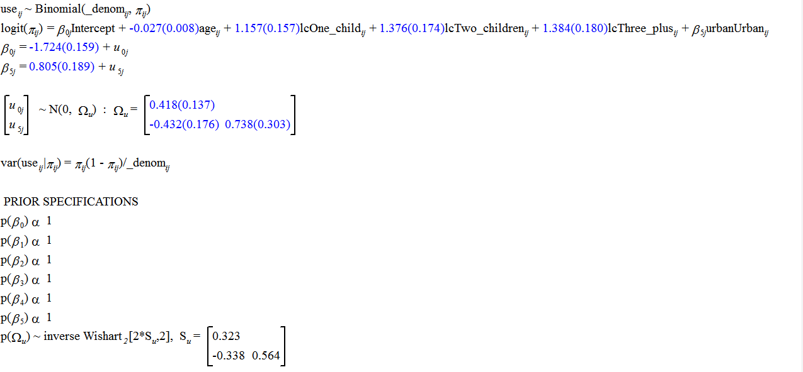

```{r setup, include=FALSE}
knitr::opts_chunk$set(echo = TRUE)
```

```{r, include=FALSE}
options(MLwiN_path = "C:/Program Files (x86)/MLwiN trial/i386/")
suppressMessages(library(R2MLwiN))
options(scipens = 9999999999999999999)
```

# Vorwort
Dieses Dokument dient dem Erlernen des Umgangs mit `R2MLWIN`. Zudem vergleiche ich die Syntax mit der von `runmlwin`. Weiteres zur Modellexplikation findet sich unter `10.3 Random coefficients for area type` in [@Browne.2016].  


# Model 

$$
\text{logit}(\pi_{ij}) 
= \beta_0 
+ \beta_1 \text{age}_{ij} 
+ \beta_2 \text{lcOnechild}_{ij} 
+ \beta_3 \text{lcTwochildren}_{ij} 
+ \beta_4 \text{lcThreeplus}_{ij} 
+ \beta_5 \text{urban}_{ij} 
+ u_{0j} 
+ u_{5j} \text{urban}_{ij}
$$

# R-Syntax

```{r}
data("bang1")
F6 <- logit(use) ~ 1 + age + lc + urban + (1 + urban | district)
```


```{r}
(binomialMCMC <- runMLwiN(Formula = F6, D = "Binomial", data = bang1, 
                         estoptions = list(EstM = 1)))#, debugmode=T))
#trajectories(binomialMCMC["chains"][,"FP_Intercept", drop = FALSE])
```


# Ansicht in MLWIN

 


# Syntax in Stata:


```{r stata, engine="stata", eval=FALSE}
quietly runmlwin use cons age onekid twokids threepluskids urban, ///
	level2(district: cons urban) ///
	level1(woman:) ///
	discrete(distribution(binomial) link(logit) denom(cons)) nopause

runmlwin use cons age onekid twokids threepluskids urban, ///
	level2(district: cons urban) ///
	level1(woman:) ///
	discrete(distribution(binomial) link(logit) denom(cons)) ///
	mcmc(on) initsprevious pause
```

# Literatur