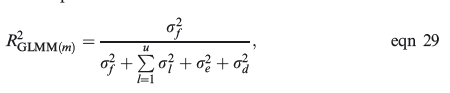
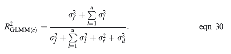
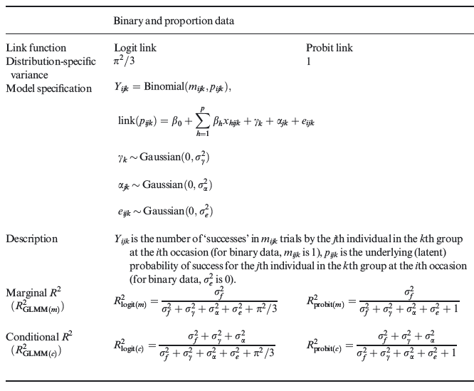

```{r setup, include=FALSE}
knitr::opts_chunk$set(echo = TRUE)
library(arm)
library(lme4)
```


# 2. Analysis of colour morphs (Binomial mixed models)

```{r}
# Clear memory
rm(list = ls())
# Read colour morph data (Binary, available for males only)


library(AzureML)
ws <- workspace()

Data <- download.datasets(
  dataset = ws, 
  name    = "BeetlesMale.csv")

```

---

```{r}
# Fit null model without fixed effects (but including all random effects)
m0 <- glmer(Colour ~ 1 + (1 | Population) + (1 | Container), 
            family = "binomial", data = Data)
summary(m0)
```

---

```{r}
# Fit alternative model including fixed and all random effects
mF <- glmer(Colour ~ Treatment + Habitat + (1 | Population) + (1 | Container), 
            family = "binomial", data = Data)
summary(mF)
```

---

```{r}
# Extraction of fitted value for the alternative model 
# fixef() extracts coefficents for fixed effects 
# mF@X returns fixed effect design matrix
Fixed <- fixef(mF)[2] * getME(mF,"X")[, 2] + fixef(mF)[3] * getME(mF,"X")[, 3]

fixef(mF)[2]
fixef(mF)[3]
```

---

```{r}
# Calculation of the variance in fitted values
VarF <- var(Fixed)

VarF
```

---


```{r}
# An alternative way for getting the same result
VarF <- var(as.vector(fixef(mF) %*% t(getME(mF,"X"))))
```


\newpage


 


```{r}
# R2GLMM(m) - marginal R2GLMM
# see Equ. 29 and 30 and Table 2
VarF/(VarF + VarCorr(mF)$Container[1] + VarCorr(mF)$Population[1] + pi^2/3)
```


---

```{r}
VarCorr(mF)$Container[1]
VarCorr(mF)$Population[1]
```

---

 


```{r}
# R2GLMM(c) - conditional R2GLMM for full model
# Equ. XXX, XXX
(VarF + VarCorr(mF)$Container[1] + VarCorr(mF)$Population[1])/
  (VarF + VarCorr(mF)$Container[1] + VarCorr(mF)$Population[1] + pi^2/3)
```


 


# Literatur


