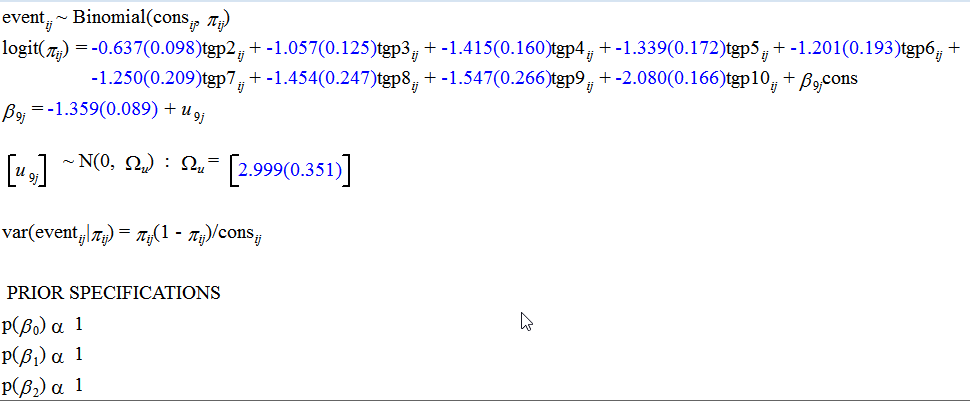
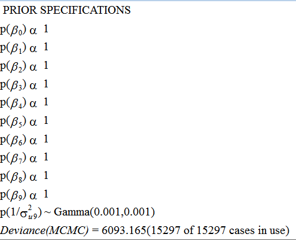

```{r}

options(MLwiN_path = "C:/Program Files (x86)/MLwiN trial/i386/")

library(tidyverse)
library(haven)
suppressMessages(library(R2MLwiN))
library(modelr)
library(AzureML)

ws <- workspace()

daten <- download.datasets(
  dataset = ws, 
  name    = "statafile.csv")

daten <- tbl_df(daten)

```

# Modell 1

```{r}

form <- logit(event, cons) ~ tgp2 + tgp3 + tgp4 + tgp5 + tgp6 + tgp7 + tgp8 + tgp9 + tgp10 + cons + (cons | l2id)

runMLwiN(form , D = "Binomial", estoptions = list(EstM = 1, mcmcMeth=list(seed=1, orth=1)),  data = daten)


```


## Ansicht in MLWIN






## Stata-Syntax

```{r stata, engine="stata", eval=FALSE}

*Fit random effects logit model with tgp=1 as the reference

*MQL1 estimates (to get starting values for MCMC)
*These are only approximate for multilevel models. 
*It is strongly recommended that you use MCMC.

runmlwin event ///
  tgp2-tgp10 cons, ///
  level2(l2id: cons) ///
  level1(l1id:) ///
  discrete(distribution(binomial) link(logit) denom(cons)) maxi(50) nopause 

*Now estimate the model using MCMC. We specify a burn-in of 500 and chain length of 5000 (but in practice longer chains
                                                                                          *will be required).  The 'initsprevious' tells MLwiN to use estimates from the previous model as starting values. 
*The 'orth' and 'parexpansion' options specify the use of orthogonal fixed effects and
*parameter expansion to improve efficiency of MCMC sampling.
*See Chapters 24 of the 'MCMC Estimation in MLwiN' User Guide at http://www.bristol.ac.uk/cmm/software/mlwin/download/manuals.html
*A random number seed is used to ensure we get the same results each time the model is re-run.

runmlwin event ///
  tgp2-tgp10 cons, ///
  level2(l2id: cons, parexpansion) ///
  level1(l1id:) ///
  discrete(distribution(binomial) link(logit) denom(cons)) ///
  mcmc(burnin(500) chain(5000) orth seed(1)) initsprevious pause

```


# Modell 2 & Parameteränderungen


```{r}
form2 <- logit(event, cons) ~ 
  tgp2   + tgp3   + tgp4   + tgp5   + tgp6   + tgp7   + tgp8   + tgp9   + tgp10 + 
  agegp1 + agegp2 + agegp3 + agegp4 + agegp5 + agegp6 + agegp7 + agegp8 + everjob +
  cons   + (cons | l2id)
```


```{r}

eins <- list(EstM = 1, mcmcMeth=list(seed=1, orth=1))

zwei <- list(EstM = 0, 
             mcmcMeth  = list(seed=1), 
             nonlinear = c(N = 0 , M = 1))

drei <- list(EstM        = 1, 
             mcmcMeth    = list(seed=1),
             Meth        = 1, 
             nonlinear   = c(N = 0 , M = 1),
             mcmcOptions = list(paex = c(2, 1), orth = 1))


# runMLwiN(form2 , D = "Binomial", estoptions = eins, data = daten)

# runMLwiN(form2 , D = "Binomial", estoptions = zwei, data = daten)

```


